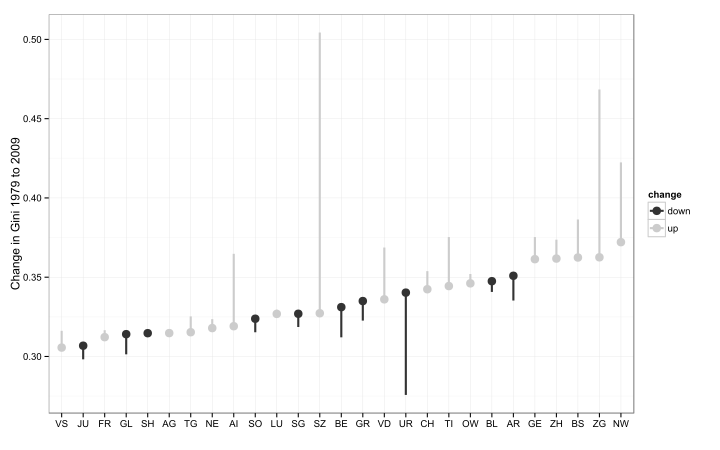
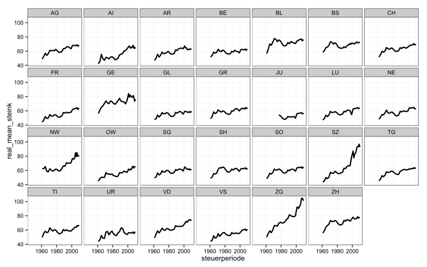
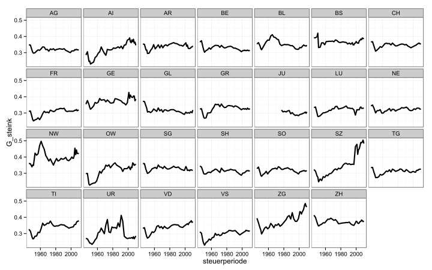
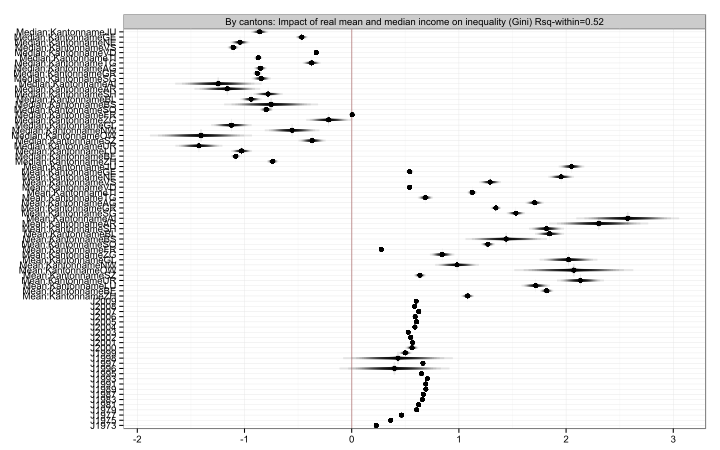
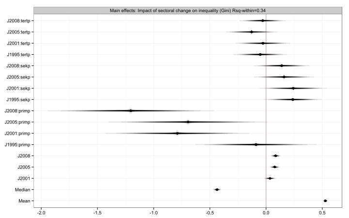
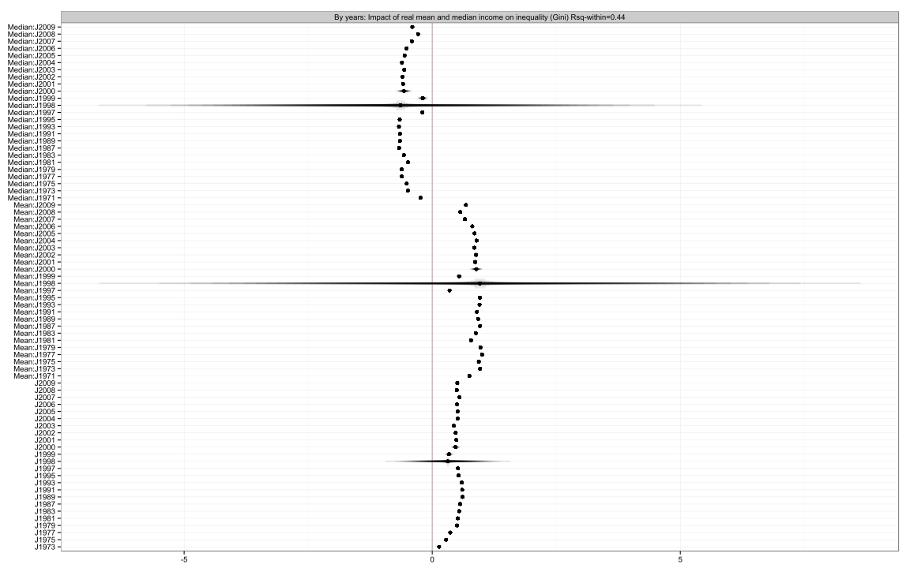

% Entwicklung der Ungleichheit in der Schweiz - Kongressbandbeitrag zum SGS Kongress 2013
% Oliver Hümbelin, Berner Fachhochschule <br />Rudi Farys, Universität Bern
% 28. Februar 2014


```
## Loading required package: Formula
```


<!---
### Versuch, die Kantone in 3-4 Typen einteilen, je nach Entwicklung der Ungleichheit/Einkommen (unfertig)
-->


# Change in Gini (taxable income) 1979 to 2009




verschiedene Typen von Kantonen:

* SZ, AI (Zunahme der Ungleichheit ausgehend von einem niedrigen Niveau)
* ZG, NW, GE (Zunahme der Ungleichheit ausgehend von einem hohen Niveau)
* AG, SH, FR, SG, NE, LU (stabile Ungleichheit auf niedrigem Niveau)
* ZH, TI (stabile Ungleichheit auf hohem Niveau)
* BE, UR, SO (abnehmende Ungleichheit)

# Sample ziehen (für die Kongressfolien; für den Kongressband alle Kantone?)


<!---
# Ungleichheitsniveau versus Veränderung der Ungleichheit von 1979-2009
-->


# Veränderung des durchschnittlichen steuerbaren Einkommens nach Kantonen (preisbereinigt auf 2009er Niveau)




# Veränderung des Gini-Koeffizienten (steuerbares Einkommen) nach Kantonen




<!---
### Tabelle der Typen und Makrovariablenausprägungen: (unfertig, sieht aus, als käme nichts raus)

* Steuerprogression
* Demographie
* Sprachregion
* Zentrum/Peripherie
* Wirtschaftsstruktur
-->

<!---
## Entwicklung der Ungleichheit zwischen Kantonen


### Theil berechnen 

Brauchen wir das?
-->


# Dekomposition

# Reldist-Plots

# Regressionsmodelle: y = Gini Koeffizient der Gemeinden


# FE mit mean und median


# Einfluss von mittlerem und medianem steuerbaren Realeinkommen nach Kanton




```
## Oneway (individual) effect Within Model
## 
## Call:
## plm(formula = Gini ~ Mean + Median + J + J:(primp + sekp + tertp), 
##     data = plm_daten, index = "Gemeindenr")
## 
## Unbalanced Panel: n=2558, T=1-4, N=9484
## 
## Residuals :
##     Min.  1st Qu.   Median  3rd Qu.     Max. 
## -5.77000 -0.11100 -0.00784  0.10500  3.35000 
## 
## Coefficients :
##             Estimate Std. Error t-value Pr(>|t|)    
## Mean         0.52705    0.00929   56.73  < 2e-16 ***
## Median      -0.43622    0.01448  -30.12  < 2e-16 ***
## J2001        0.03517    0.02025    1.74   0.0825 .  
## J2005        0.07688    0.01791    4.29  1.8e-05 ***
## J2008        0.08488    0.01770    4.79  1.7e-06 ***
## J1995:primp -0.08955    0.21056   -0.43   0.6706    
## J2001:primp -0.78916    0.24950   -3.16   0.0016 ** 
## J2005:primp -0.69399    0.27442   -2.53   0.0115 *  
## J2008:primp -1.20423    0.28674   -4.20  2.7e-05 ***
## J1995:sekp   0.23813    0.10008    2.38   0.0174 *  
## J2001:sekp   0.24216    0.11663    2.08   0.0379 *  
## J2005:sekp   0.15992    0.10426    1.53   0.1251    
## J2008:sekp   0.13881    0.09632    1.44   0.1496    
## J1995:tertp -0.05133    0.09296   -0.55   0.5808    
## J2001:tertp -0.02785    0.09474   -0.29   0.7688    
## J2005:tertp -0.12880    0.08930   -1.44   0.1493    
## J2008:tertp -0.02965    0.08022   -0.37   0.7117    
## ---
## Signif. codes:  0 '***' 0.001 '**' 0.01 '*' 0.05 '.' 0.1 ' ' 1
## 
## Total Sum of Squares:    772
## Residual Sum of Squares: 512
## R-Squared      :  0.337 
##       Adj. R-Squared :  0.245 
## F-statistic: 206.116 on 17 and 6909 DF, p-value: <2e-16
```


# Plot Sektorenmodell




# Zeitliche Dynamik der Einflüsse von mittlerem und medianem Einkommen auf die Ungleichheit




<!---
### Bildungsausgaben/Uniabschlüsse
-->


# Resultate - Mittleres und medianes Einkommen nach Jahren:

* die Periode-Dummies weisen darauf hin, dass wichtige Variablen fehlen
* positive Korrelation mit mittlerem Einkommen und
* negative Korrelation mit medianem Einkommen, d.h.
* die Ungleichheitszuwächse stammen von steigenden Topeinkommen
* Korrelation 1997 und 2007-2009 schwächer (Krisenjahre)
* in diesen Jahren entwickeln sich beide Enden der Einkommensverteilung gleichartiger
* vereinfachend gesprochen: **arme Gemeinden haben während des Booms weniger profitiert als reiche aber während der Krisen dasselbe verloren!

# Resulte - Mittleres und medianes Einkommen nach Kantonen:

* ähnliches Bild wie in den reldist Plots
* zum Beispiel:
  <ul><li>Fribourg hat sich sehr homogen entwickelt (Fahrstuhleffekt)
  <li>In Schwyz profitieren Reiche besonders, die armen werden aber nicht ärmer
  <li>In Genf sind die Armen weiter verarmt
  <li>Die Ungleichheit in Bern und Zürich reagiert stark auf Einkommensänderungen, es gab aber wenig Veränderung. Bern und Zürich wären daher gemäss Modell wesentlich ungleicher, wenn sie wirtschaftliches Wachstum gehabt hätten.</ul>
* Mögliche Erklärungen:
  <ul><li>schwierig
  <li>der Einfluss von mittleren und medianem Einkommen könnte nicht-linear sein</ul>
* Hier nicht untersucht: der Einfluss politischer Massnahmen

Sonstige Hinweise:
* Gini, `Mean` und `Median` sind z-Standardisiert!
* Einfluss von `mean` und `median` unterschiedlich: In der Finanzkrise umgekehrt. Versuch einer Interpretation: Normalerweise steigt der Median und die Ungleichheit fällt dadurch. In den Finanzkrisenjahren ist der Median gleichgeblieben aber die Ungleichheit gestiegen oder der Median gestiegen aber die Ungleichheit nicht gefallen. Wenn `mean` steigt steigt normal auch die Ungleichheit. In der Finanzkrise: `mean` steigt, Ungleichheit fällt.
* Zeitdummies: erklären vergleichsweise viel, d.h. im Modell fehlen offenbar noch zeitveränderliche Variablen


# Resulte - Sektorenwandel

* 2001, 2005, 2008: Einkommen im primären Sektor liegen zunehmend näher am Medianeinkommen
* Tertiärer Sektor: überraschenderweise kein Einfluss
* Sekundärer Sektor: verschwindender Einfluss im Laufe der Zeit; auch eher überraschen, da man positiven Einfluss erwartet
* Mögliche Erklärungen: 
<ul><li>"der moderne reiche schweizer Bauer"
  <li>weniger Heterogenität im teriären Sektor als man vermuten würde
  <li>Lohndifferenzen im sekundären Sektor die aber abnehmen</ul>
  
# Fallstricke

* `steuerbares Einkommen' zeigt nicht das ganze Bild, z.B.
* Pauschalbesteuerte sind nicht enthalten
* Verzerrungen durch Änderungen der Abzüge
* Diese Probleme addressieren wir in zukünftigen Analysen mit Individualdaten von schweizer Kantonen

# Appendix - Einfluss anderer Kontextvariablen


```
## Oneway (individual) effect Within Model
## 
## Call:
## plm(formula = Gini ~ poly(Mean, 2) + poly(Median, 2) + J + ausl + 
##     maenner + Bild + Uni + Kantonname, data = plm_daten, index = "Gemeindenr")
## 
## Unbalanced Panel: n=2576, T=1-10, N=21214
## 
## Residuals :
##    Min. 1st Qu.  Median 3rd Qu.    Max. 
## -2.1900 -0.0755 -0.0045  0.0695  4.7300 
## 
## Coefficients :
##                   Estimate Std. Error t-value Pr(>|t|)    
## poly(Mean, 2)1    2.53e+02   1.55e+00  162.80  < 2e-16 ***
## poly(Mean, 2)2   -9.87e+01   9.67e-01 -102.13  < 2e-16 ***
## poly(Median, 2)1 -1.65e+02   1.99e+00  -83.05  < 2e-16 ***
## poly(Median, 2)2  1.84e+01   1.35e+00   13.60  < 2e-16 ***
## J2001             1.99e-02   1.35e-02    1.48    0.140    
## J2002             2.81e-02   1.41e-02    2.00    0.045 *  
## J2003             1.22e-02   1.45e-02    0.84    0.400    
## J2004             7.51e-02   1.46e-02    5.15  2.6e-07 ***
## J2005             8.47e-02   1.53e-02    5.54  3.0e-08 ***
## J2006             6.74e-02   1.64e-02    4.12  3.8e-05 ***
## J2007             9.95e-02   1.78e-02    5.59  2.4e-08 ***
## J2008             7.94e-02   1.95e-02    4.07  4.7e-05 ***
## J2009             9.70e-02   2.02e-02    4.81  1.6e-06 ***
## ausl              2.14e-01   1.09e-01    1.97    0.049 *  
## maenner           9.96e-02   1.65e-01    0.60    0.545    
## Bild             -6.38e-02   6.02e-03  -10.58  < 2e-16 ***
## Uni              -1.89e-03   5.78e-03   -0.33    0.744    
## ---
## Signif. codes:  0 '***' 0.001 '**' 0.01 '*' 0.05 '.' 0.1 ' ' 1
## 
## Total Sum of Squares:    1660
## Residual Sum of Squares: 642
## R-Squared      :  0.614 
##       Adj. R-Squared :  0.539 
## F-statistic: 1741.47 on 17 and 18621 DF, p-value: <2e-16
```


* leicht positiver Effekt für Ausländer (Ärzte vs. Niedriglohnkräfte?)
* Bildungsausgaben verringern Ungleichheit
* nach wie vor viel Erklärung durch Periodendummies, d.h. fehlende Variablen

# To-Do:

## Steuerprogression

* Errechnen aus Gini_steuern / Gini_steink!

## Dekomposition

* Steuerwettbewerb, Konjunktur vs. Staat

# Vermögen

