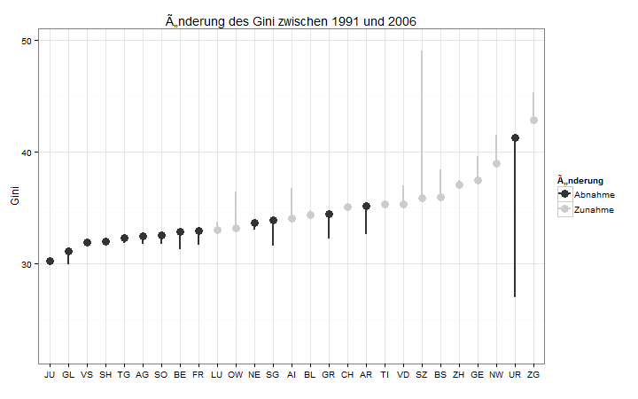
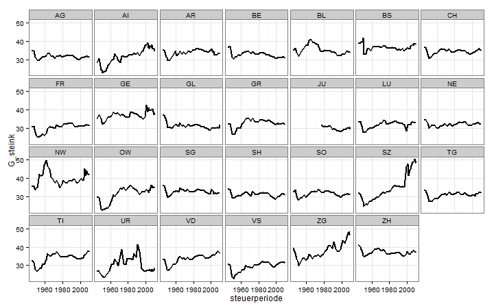

% Entwicklung der Ungleichheit in der Schweiz - Kongressbandbeitrag zum SGS Kongress 2013
% Oliver Hümbelin, Berner Fachhochschule <br />Rudi Farys, Universität Bern
% 28. Februar 2014


```
## Error: Objekt 'daten' nicht gefunden
```


# Veränderung des Gini (steuerbares Einkommen) 




Für die erste betrachtete Periode von 1950 bis 1971 (letzte Steuerperiode vor der Ölkrise) ergibt sich ein Bild von überwiegend zunehmender Ungleichheit. Stimmig scheint aber auch eine Interpretation als Konvergenz: Kantone mit besonders niedriger Ungleichheit haben überproportional zugelegt. Gleichzeitig ist Basel-Stadt als ungleichster Kanton wieder zurück auf Rang 5. Für diese Periode müssen die Erklärungen vorwiegend in der wirtschaftlichen Entwicklung gesucht werden (der Ausbau des Sozialstaats kam später). Denkbar wäre eine Angleichung der Sektorenzusammensetzung in dieser Zeit. Für die Periode von 1971 bis 1991 (noch vor der Strukturkrise) zeigt sich primär der Einfluss des Steuerwetttbewerbs. So nahm die Ungleichheit insbesondere in den Kantonen Schwyz, Zug, Uri, Appenzell Innerrhoden zu. Für die Periode von 1991 bis 2006 (vor der Finanzkrise) zeigt sich ebenfalls ein Bild das durch den Steuerwettbewerb dominiert ist. So hat die Ungleichheit in Obwalden, Nidwalden, Schwyz und Zug weiter zugenommen, Uri jedoch scheint im Laufe des Wettbewerbs wieder "zu verlieren". Für den letzten Beobachtungszweitraum von 2006 bis 2010 welcher die Finanzkrise einschliesst zeigt sich kein besonders auffälliges Bild. Die Levels der Kantone sind über diese Zeit bemerkenswert stabil geblieben. Insgesamt lässt sich sagen, dass die Betrachtung auf kantonaler Ebene das eindrückliche Ausmass des Steuerwettbewerbs aufzeigt, wohingegen die gesamtschweizerische Betrachtung die Kräfte des Steuerwettbewerbs gänzlich übersieht.

verschiedene Typen von Kantonen:

* SZ, AI (Zunahme der Ungleichheit ausgehend von einem niedrigen Niveau)
* ZG, NW, GE (Zunahme der Ungleichheit ausgehend von einem hohen Niveau)
* AG, SH, FR, SG, NE, LU (stabile Ungleichheit auf niedrigem Niveau)
* ZH, TI (stabile Ungleichheit auf hohem Niveau)
* BE, UR, SO (abnehmende Ungleichheit)

# Sample ziehen (für die Kongressfolien; für den Kongressband alle Kantone?)


<!---
# Ungleichheitsniveau versus Veränderung der Ungleichheit von 1979-2009
-->


# Veränderung des durchschnittlichen steuerbaren Einkommens nach Kantonen (preisbereinigt auf 2009er Niveau)


# Veränderung des Gini-Koeffizienten (steuerbares Einkommen) nach Kantonen




# Lorenzkurve


# Schweizkarte nach Durhschnittseinkommen


```
## Error: Indizierung außerhalb der Grenzen
```


Die Darstellung der Einkommen auf Gemeindeebene in einer Karte liefert noch einige weitere Informationen zum Gesamtbild die aus den deskriptiven Statistiken der Kantone und den Regressionsmodellen nicht direkt ersichtlich sind. Zum einen ist zu sehen, dass es ein relativ starkes Stadt-Land-Gefälle gibt, bzw. dass das Einkommen stark von der Bevölkerungsdichte getrieben ist. Beispielsweise kann man sehen, dass die Kantone Bern und Tessin, die bezüglich ihres Durchschnittseinkommens eher in der unteren Hälfte rangieren, grössere zusammenhängende Landstriche mit hohem Einkommen besitzen. Waadt und Zürich fallen dagegen durch eine homogen hohe Bevölkerungsdichte und die Abwesenheit von grösseren ländlichen Gebieten ins obere Drittel des Einkommensrankings. Jura, Schwyz, Zug und Nidwalden bilden die wenigen Ausnahmen. Während im Jura das Einkommen in Relation zur Bevölkerungdichte eher niedrig ist stechen die ländlichen Kantone Schwyz, Nidwalden und Zug durch den Steuerwettbewerb mit hohen Einkommen hervor. Ein Grossteil des Durchschnittseinkommens lässt sich also womöglich durch die Entwicklung der Bevölkerungsdichte (z.B. aufgrund von Geografischen Begebenheiten wie die Nähe zu Seen und die Abwesenheit von Bergen) zurückführen.


<!---
### Tabelle der Typen und Makrovariablenausprägungen: (unfertig, sieht aus, als käme nichts raus)

* Steuerprogression
* Demographie
* Sprachregion
* Zentrum/Peripherie
* Wirtschaftsstruktur
-->

<!---
## Entwicklung der Ungleichheit zwischen Kantonen


### Theil berechnen 

Brauchen wir das?
-->


# Dekomposition

# Reldist-Plots

# Regressionsmodelle: y = Gini Koeffizient der Gemeinden


# FE mit mean und median


```
## Error: Objekt 'daten' nicht gefunden
```

```
## Error: Objekt 'daten' nicht gefunden
```

```
## Error: Objekt 'daten' nicht gefunden
```

```
## Error: Objekt 'uni' nicht gefunden
```

```
## Error: Objekt 'daten' nicht gefunden
```


# Einfluss von mittlerem und medianem steuerbaren Realeinkommen nach Kanton


```
## Error: Objekt 'plm_daten' nicht gefunden
```

```
## Error: Fehler bei der Auswertung des Argumentes 'object' bei der Methodenauswahl
## für Funktion 'summary': Fehler: Objekt 'fit.canton' nicht gefunden
```


```
## Error: Objekt 'plm_daten' nicht gefunden
```

```
## Error: Fehler bei der Auswertung des Argumentes 'object' bei der Methodenauswahl
## für Funktion 'summary': Fehler: Objekt 'fit.sekt' nicht gefunden
```


# Plot Sektorenmodell


```
## Error: Fehler bei der Auswertung des Argumentes 'object' bei der Methodenauswahl
## für Funktion 'summary': Fehler: Objekt 'fit.sekt' nicht gefunden
```


# Zeitliche Dynamik der Einflüsse von mittlerem und medianem Einkommen auf die Ungleichheit


```
## Error: Objekt 'plm_daten' nicht gefunden
```

```
## Error: Fehler bei der Auswertung des Argumentes 'object' bei der Methodenauswahl
## für Funktion 'summary': Fehler: Objekt 'fit.time' nicht gefunden
```


<!---
### Bildungsausgaben/Uniabschlüsse
-->


# Resultate - Mittleres und medianes Einkommen nach Jahren:

* die Periode-Dummies weisen darauf hin, dass wichtige Variablen fehlen
* positive Korrelation mit mittlerem Einkommen und
* negative Korrelation mit medianem Einkommen, d.h.
* die Ungleichheitszuwächse stammen von steigenden Topeinkommen
* Korrelation 1997 und 2007-2009 schwächer (Krisenjahre)
* in diesen Jahren entwickeln sich beide Enden der Einkommensverteilung gleichartiger
* vereinfachend gesprochen: **arme Gemeinden haben während des Booms weniger profitiert als reiche aber während der Krisen dasselbe verloren!

# Resulte - Mittleres und medianes Einkommen nach Kantonen:

* ähnliches Bild wie in den reldist Plots
* zum Beispiel:
  <ul><li>Fribourg hat sich sehr homogen entwickelt (Fahrstuhleffekt)
  <li>In Schwyz profitieren Reiche besonders, die armen werden aber nicht ärmer
  <li>In Genf sind die Armen weiter verarmt
  <li>Die Ungleichheit in Bern und Zürich reagiert stark auf Einkommensänderungen, es gab aber wenig Veränderung. Bern und Zürich wären daher gemäss Modell wesentlich ungleicher, wenn sie wirtschaftliches Wachstum gehabt hätten.</ul>
* Mögliche Erklärungen:
  <ul><li>schwierig
  <li>der Einfluss von mittleren und medianem Einkommen könnte nicht-linear sein</ul>
* Hier nicht untersucht: der Einfluss politischer Massnahmen

Sonstige Hinweise:
* Gini, `Mean` und `Median` sind z-Standardisiert!
* Einfluss von `mean` und `median` unterschiedlich: In der Finanzkrise umgekehrt. Versuch einer Interpretation: Normalerweise steigt der Median und die Ungleichheit fällt dadurch. In den Finanzkrisenjahren ist der Median gleichgeblieben aber die Ungleichheit gestiegen oder der Median gestiegen aber die Ungleichheit nicht gefallen. Wenn `mean` steigt steigt normal auch die Ungleichheit. In der Finanzkrise: `mean` steigt, Ungleichheit fällt.
* Zeitdummies: erklären vergleichsweise viel, d.h. im Modell fehlen offenbar noch zeitveränderliche Variablen


# Resulte - Sektorenwandel

* 2001, 2005, 2008: Einkommen im primären Sektor liegen zunehmend näher am Medianeinkommen
* Tertiärer Sektor: überraschenderweise kein Einfluss
* Sekundärer Sektor: verschwindender Einfluss im Laufe der Zeit; auch eher überraschen, da man positiven Einfluss erwartet
* Mögliche Erklärungen: 
<ul><li>"der moderne reiche schweizer Bauer"
  <li>weniger Heterogenität im teriären Sektor als man vermuten würde
  <li>Lohndifferenzen im sekundären Sektor die aber abnehmen</ul>
  
# Fallstricke

* `steuerbares Einkommen' zeigt nicht das ganze Bild, z.B.
* Pauschalbesteuerte sind nicht enthalten
* Verzerrungen durch Änderungen der Abzüge
* Diese Probleme addressieren wir in zukünftigen Analysen mit Individualdaten von schweizer Kantonen

# Appendix - Einfluss anderer Kontextvariablen


```
## Error: Objekt 'plm_daten' nicht gefunden
```

```
## Error: Fehler bei der Auswertung des Argumentes 'object' bei der Methodenauswahl
## für Funktion 'summary': Fehler: Objekt 'fit.full' nicht gefunden
```


* leicht positiver Effekt für Ausländer (Ärzte vs. Niedriglohnkräfte?)
* Bildungsausgaben verringern Ungleichheit
* nach wie vor viel Erklärung durch Periodendummies, d.h. fehlende Variablen

# To-Do:

## Steuerprogression

* Errechnen aus Gini_steuern / Gini_steink!

## Einwohnerdichte auf Gemeindeebene

* evtl. im BfS

## Dekomposition

* Steuerwettbewerb, Konjunktur vs. Staat

# Vermögen

# Gemeinderanking und Map


# Fazit - Textbausteine

An detaillierten Informationen zur Situation der Einkommen, Vermögen und Ungleichheit in der Schweiz bestand bislang eher ein Mangel. In unserem Beitrag haben wir versucht mehrere Dimensionen von Wohlstand und dessen Ungleichheit zu erfassen und ein Gesamtbild für die Schweiz zu zeichen. Für den Längsschnitt zeigt sich etwa, dass sich Wohlstand und Ungleichheit entlang der grossen Boomzeiten und Krisen und am Ausbau des Sozialstaats entwickeln. Im Querschnitt kommt vor allem dem Steuerwettbewerb und damit den kantonalen Grenzen eine grosse Bedeutung zu. 
Trotz der umfassenden deskriptiven Analyse bleiben einige Erklärungen offen. So stellt sich etwa die Frage nach dem Wirkmechanismus der Sozialausgaben. Einerseits kann damit argumentiert werden, dass gerade in Ländern mit hoher Ungleichheit die ökonomischen oder politischen Mittel zur Umverteilung fehlen (bspw. Jamaika). Andererseits ist es möglich, dass geringe Umverteilungsbemühungen die Ungleichheit erklären können (bspw. USA). Ein wichtiger Faktor für die Schweiz ist aber sicher der Ausbau der Alters- und Hinterlassenenversicherung (AHV). 

Im SNF geförderten Projekt "Ungleichheit der Einkommen und Vermögen in der Schweiz" soll künftig mit Hilfe individueller Steuerdaten noch genauer nachgezeichnet werden welche Wirkungsmechanismen bei der Entstehung von Ungleichheit am Werk sind. Vorgesehen ist etwa die Zerlegung des Einkommens in Markteinkommen, Einkommen aus Liegenschaften und Einkommen aus Vermögen, die Nachzeichnung von innerschweizer Migrationsstörmen und dessen Rolle im Steuerwettbewerb sowie die Analyse politischer Massnahmen.
